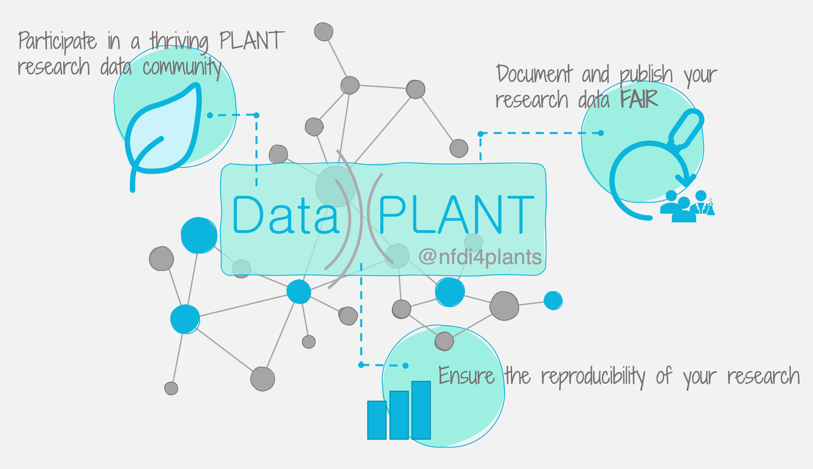

# NFDI – Nationale Forschungsdaten Infrastruktur

---

# NFDI – A community-targeted approach for RDM

---

# DataPLANT &ndash; *NFDI4plants*

- https://nfdi4plants.org
- https://arc-rdm.org

---

# Data Stewardship between DataPLANT and the community <!-- fit -->

