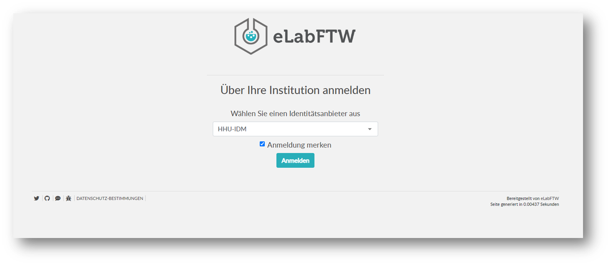
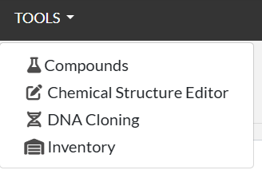

# elabFTW Introduction

---
# Login into eLabFTW HHU

---

# eLab-FTW - Dashboard

---

# eLabFTW - Experiment panel

Default "working area" for protocols of daily lab work

---

# eLabFTW - Resource panel

Place to categorize content

---

# eLabFTW - Experiment information

---

# eLabFTW - Tag usage

Very individual, some examples:
- Investigation ID
- Subgroup
- Organism /part (e.g. A.thaliana, leaf, root, mitochondria)
- Goal (strain generation, plasmid generation)
- Methode (e.g. transformation, western blot, extraction, biolector)
- Genes/ Proteins (e.g. mKate2, eGfp, Rrm4)

Use keywords you would search/filter for
:pencil: Make rules for tag usage 

---

# eLabFTW - Extra fields

---

# eLabFTW - Extra fields examples 

Dropdown            |  URL | Number          |  Date
:-------------------------:|:-------------------------:|:-------------------------:|:-------------------------:
  |   |  | 

---

# eLabFTW - Experiment categories examples

- Study
- Assay
- Discussion
- Teaching
- Demo
- R&D
- Production

---

# eLabFTW - Categories in Resources 

Use Resources to categorize content & manage lab.
Use unique identifier & naming conventions ( e.g. Methode MTH0001, Media MED0001, Plasmid PL0001).

- List of Investigation
- Investigation
- Plant sheet
- Plasmid sheet
- Equipment

- Collections
- Methods
- Manuals
- Media & Solution
- Formblatt Z

  

---

# eLabFTW - Scheduler

---

# eLabFTW - Booking parameter

You can modify booking parameter for reach Resource

---

# eLabFTW - Templates
Create templates for experiments you often use

- „Skeleton“ of a real experiment 
- Select „Templates“ from User menu
- You can have different permissions for the template itself and for Experiment that will created from that template 
- You can add tags, steps, links to it (e.g. link to project)
- Can also be imported directly in your text (allows merging several templates in one experiment)

---

# eLabFTW - Tipps and tricks
- Use # to link experiments/resources in the text
- Use .gb files for plasmid cards ( can be opend in a plasmid viewer in elabFTW) 
- Use versions, possibility to upload new versions of files/methods

---
# eLabFTW Version 5.2 

  

 ## New features
- chemical compounds database, sketcher
- Inventory management 
- OpenCloning embed

## Changes
- move search input into page 
- create Template page to list templates 
  

  

  
  

  

## Changes
- move search input into page 
- create Template page to list templates 

---
# eLabFTW - Support

## General
https://github.com/elabftw/elabftw 
https://www.elabftw.net/ (Newsletter)

## HHU specific
elabftw@hhu.de
https://rocketchat.hhu.de/channel/elb_eln
https://wiki.hhu.de/display/ZIM/eLabFTW

