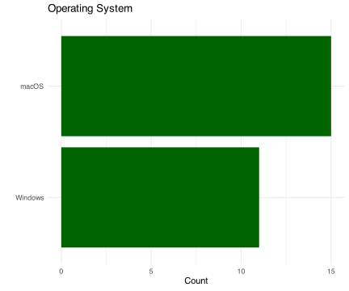
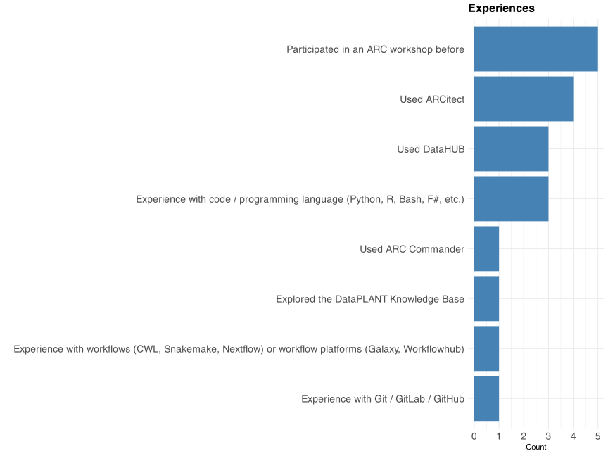

## Introduce yourself

<v-clicks>

- Used code / programming language before?
- Experience with Git / GitLab / GitHub?
- Operating system: Linux / Windows / Mac?
- Expectation

</v-clicks>

---

## Your OS

---

## Your experience with ARCs

