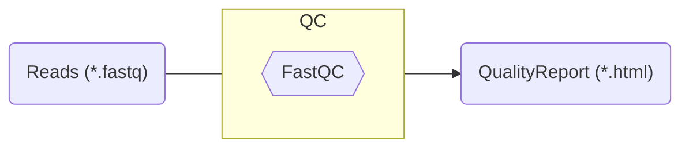
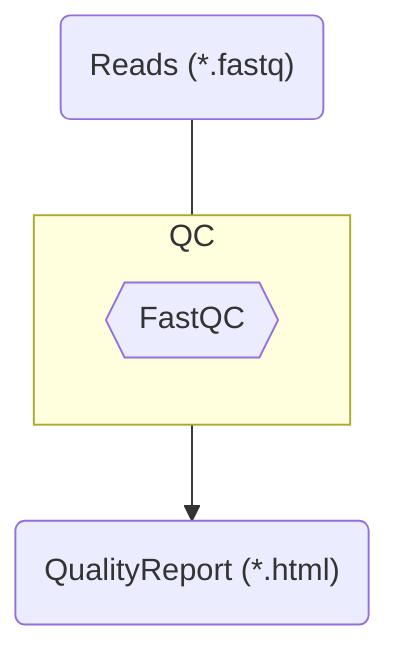
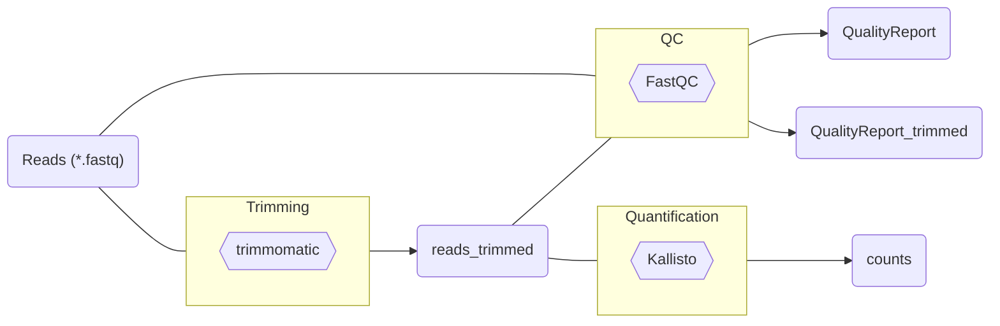

# Example tool: FastQC

First step in RNASeq data analysis: QC of read files (e.g. *.fastq)



---
layout: two-columns
---

# FastQC has a GUI

::left::



::right::


---

# Are we **FAIR**, yet?

- where did I click
- reproducibility
- record exactly what I've done
- history
- instruction
- tool version
- ...

<!-- 
- Installation / Environment
- Version
- Input / Output
 -->

---

# Command line tool

- Some tool that you can run ... on the command line
- Example:
  - CLI: **ARC Commander**
  - (GUI: **ARCitect**)
- Takes arguments or parameters as **inputs**
- Generates **outputs**

---

# FastQC via command line

```bash
fastqc --version
fastqc --help
```

---

# FastQC via command line

`fastqc assays/rnaseq/dataset/blau1_CGATGT_L005_R1_002.fastq.gz`


---
layout: center
---

# Demo: CWL-Wrapping the CommandLineTool FastQC

---

# Step 1

- Without in/out
- (Requires **local tool installed**)

```yaml
#!/usr/bin/env cwl-runner
cwlVersion: v1.2
class: CommandLineTool

baseCommand: ["fastqc", "--help"]

inputs: []
 
outputs: []
```

---

# Step 2: Add a docker container

```yaml
#!/usr/bin/env cwl-runner
cwlVersion: v1.2
class: CommandLineTool

hints:
  DockerRequirement:
    dockerPull: quay.io/biocontainers/fastqc:0.11.9--hdfd78af_1

baseCommand: ["fastqc", "--help"]

inputs: []
 
outputs: []
```

---

# Step 3: Define inputs

```yaml
#!/usr/bin/env cwl-runner
cwlVersion: v1.2
class: CommandLineTool

hints:
  DockerRequirement:
    dockerPull: quay.io/biocontainers/fastqc:0.11.9--hdfd78af_1

baseCommand: ["fastqc"]

inputs:
  reads:
    type: File[]
    inputBinding:
      position: 1

arguments: 
  - valueFrom: $(runtime.outdir)
    prefix: "-o"
 
outputs: []
```
---

# Step 4: Define outputs


```yaml{*}{maxHeight:'80%'}
#!/usr/bin/env cwl-runner
cwlVersion: v1.2
class: CommandLineTool

hints:
  DockerRequirement:
    dockerPull: quay.io/biocontainers/fastqc:0.11.9--hdfd78af_1

baseCommand: ["fastqc"]

inputs:
  reads:
    type: File[]
    inputBinding:
      position: 1

arguments: 
  - valueFrom: $(runtime.outdir)
    prefix: "-o"

outputs:
  fastqc_out:
      type: File[]
      outputBinding:
        glob:
          - "*_fastqc.zip"
          - "*_fastqc.html"
```

---
layout: two-columns
---

# Step 4: Define outputs

::left::

```yaml{*}{maxHeight:'80%'}
#!/usr/bin/env cwl-runner
cwlVersion: v1.2
class: CommandLineTool

hints:
  DockerRequirement:
    dockerPull: quay.io/biocontainers/fastqc:0.11.9--hdfd78af_1

baseCommand: ["fastqc"]

inputs:
  reads:
    type: File[]
    inputBinding:
      position: 1

arguments: 
  - valueFrom: $(runtime.outdir)
    prefix: "-o"

outputs:
  fastqc_out:
      type: File[]
      outputBinding:
        glob:
          - "*_fastqc.zip"
          - "*_fastqc.html"
```

::right::


---

# Run the workflow

You can provide arguments via another file:

`run.yml`

```yaml
reads:
  - class: File
    path: ../../assays/rnaseq/dataset/blau1_CGATGT_L005_R1_002.fastq.gz
  - class: File
    path: ../../assays/rnaseq/dataset/blau2_TGACCA_L005_R1_002.fastq.gz
```

---
layout: default
---

# Growing pipeline: First steps RNASeq pipeline



---