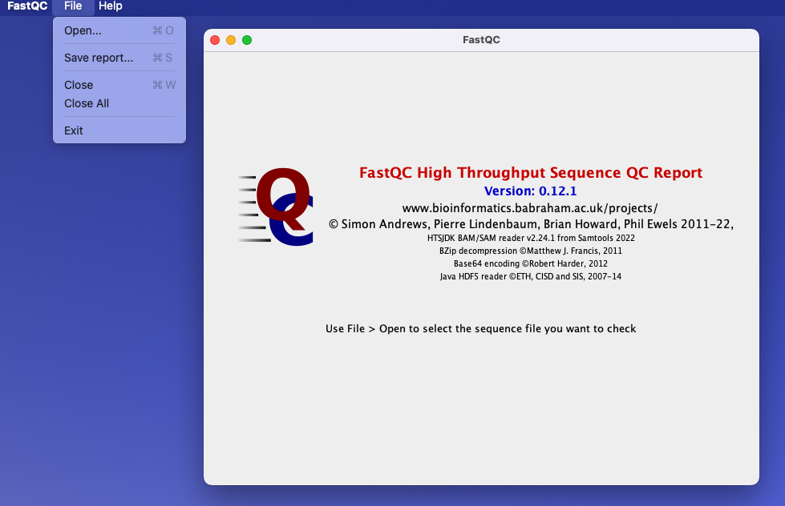
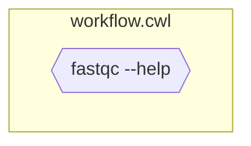
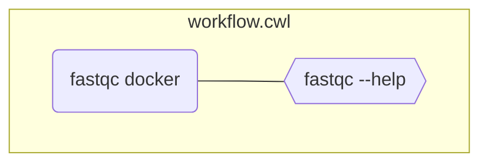
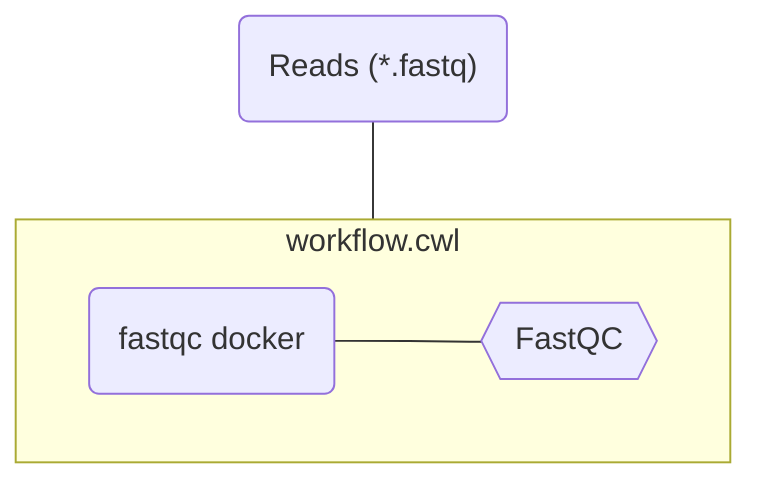
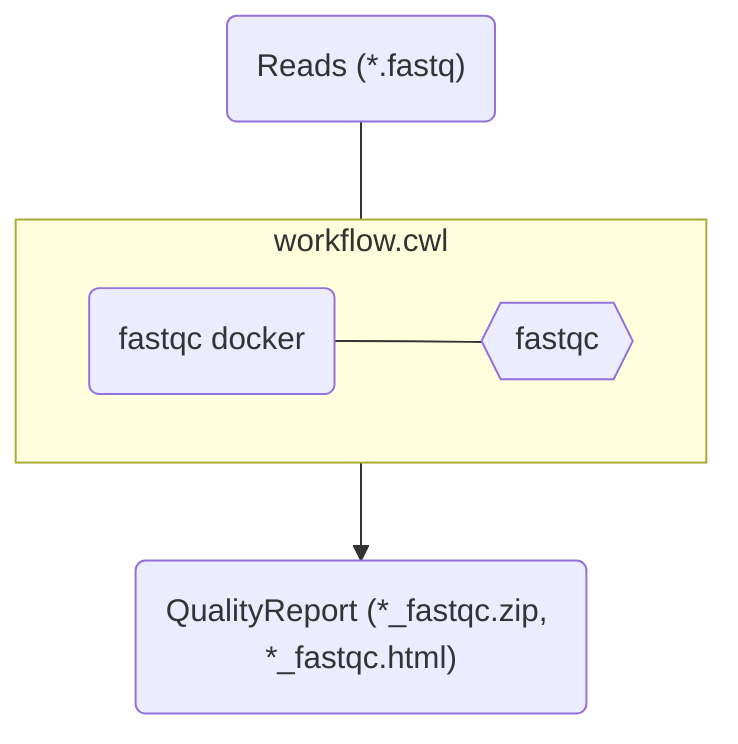
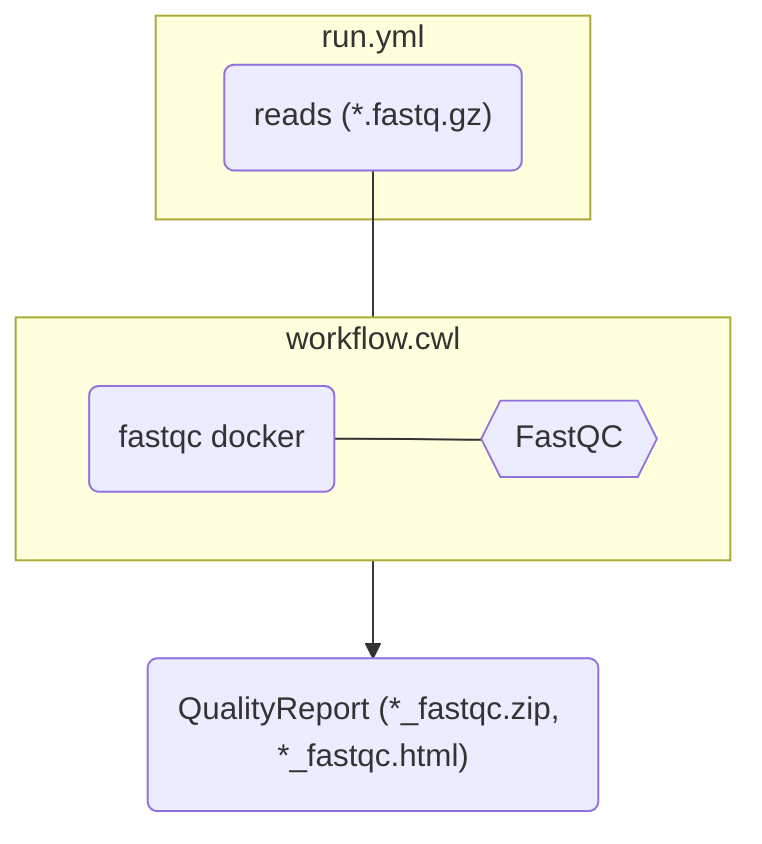
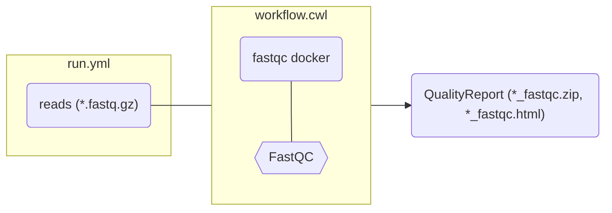

# Example tool: FastQC

First step in RNASeq data analysis: QC of read files (e.g. *.fastq)


---
layout: two-columns
---

# FastQC has a GUI

::left::


::right::




---

# Command line tool

- Some tool that you can run ... on the command line
- Example:
  - CLI: **ARC Commander**
  - (GUI: **ARCitect**)
- Takes arguments or parameters as **inputs**
- Generates **outputs**

---

# FastQC via command line

```bash
fastqc --version
fastqc --help
```

---

# FastQC via command line

`fastqc assays/rnaseq/dataset/blau1_CGATGT_L005_R1_002.fastq.gz`


---
layout: center
---

# Demo: CWL-Wrapping the CommandLineTool FastQC

---
layout: two-columns
---

# Step 1: Define CLI tool as CWL CommandLineTool

::left::

- Without in/out
- (Requires **local tool installed**)


```yaml [workflow.cwl]
#!/usr/bin/env cwl-runner
cwlVersion: v1.2
class: CommandLineTool

baseCommand: ["fastqc", "--help"]

inputs: []
 
outputs: []
```

::right::




---
layout: two-columns
---

# Step 2: Add a docker container

::left::

```yaml [workflow.cwl] {5-7}
#!/usr/bin/env cwl-runner
cwlVersion: v1.2
class: CommandLineTool

hints:
  DockerRequirement:
    dockerPull: quay.io/biocontainers/fastqc:0.11.9--hdfd78af_1

baseCommand: ["fastqc", "--help"]

inputs: []
 
outputs: []
```

::right::

<div class="scale-75 origin-top">



</div>

---
layout: two-columns
---

# Step 3: Define inputs

::left::

```yaml [workflow.cwl] {12-19}
#!/usr/bin/env cwl-runner
cwlVersion: v1.2
class: CommandLineTool

hints:
  DockerRequirement:
    dockerPull: quay.io/biocontainers/fastqc:0.11.9--hdfd78af_1

baseCommand: ["fastqc"]

inputs:
  reads:
    type: File[]
    inputBinding:
      position: 1

arguments: 
  - valueFrom: $(runtime.outdir)
    prefix: "-o"
 
outputs: []
```

::right::

<div class="scale-75 origin-top">



</div>


---
layout: two-columns
---

# Step 4: Define outputs

::left::

```yaml [workflow.cwl] {21-27}{maxHeight:'70%'}
#!/usr/bin/env cwl-runner
cwlVersion: v1.2
class: CommandLineTool

hints:
  DockerRequirement:
    dockerPull: quay.io/biocontainers/fastqc:0.11.9--hdfd78af_1

baseCommand: ["fastqc"]

inputs:
  reads:
    type: File[]
    inputBinding:
      position: 1

arguments: 
  - valueFrom: $(runtime.outdir)
    prefix: "-o"

outputs:
  fastqc_out:
      type: File[]
      outputBinding:
        glob:
          - "*_fastqc.zip"
          - "*_fastqc.html"
```

::right::

<div class="scale-75 origin-top">




</div>


---
layout: two-cols-header
---

# Run the workflow

You can provide arguments via another file:

::left::

```yaml [run.yml]
reads:
  - class: File
    path: ../../assays/rnaseq/dataset/blau1_CGATGT_L005_R1_002.fastq.gz
  - class: File
    path: ../../assays/rnaseq/dataset/blau2_TGACCA_L005_R1_002.fastq.gz
```


::right::

<div class="scale-75 origin-top">



</div>


---
layout: two-cols-header
---

# Run the workflow

You can provide arguments via another file:

::left::

```yaml [run.yml]
reads:
  - class: File
    path: ../../assays/rnaseq/dataset/blau1_CGATGT_L005_R1_002.fastq.gz
  - class: File
    path: ../../assays/rnaseq/dataset/blau2_TGACCA_L005_R1_002.fastq.gz
```

```yaml [workflow.cwl] {11-13}
#!/usr/bin/env cwl-runner
cwlVersion: v1.2
class: CommandLineTool

hints:
  DockerRequirement:
    dockerPull: quay.io/biocontainers/fastqc:0.11.9--hdfd78af_1

baseCommand: ["fastqc"]

inputs:
  reads:
    type: File[]
    inputBinding:
      position: 1
...
```

::right::

<div class="scale-85 origin-top">



</div>

<div class="scale-95 origin-right">


```bash
cwltool workflow.cwl run.yml
```

</div>


---
layout: default
---

# Growing pipeline: First steps RNASeq pipeline


---