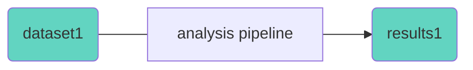
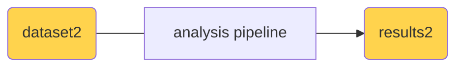

# What Are Computational Workflows?

- Define **steps** in data analysis (e.g., preprocessing → alignment → QC)
- Each step specifies:
  - **Inputs**
  - **Outputs**
  - **Tools / Commands**
- Enable:
  - Reproducibility  
  - Portability  
  - Scalability

---

# Materials & Methods ✅

```bash
fastqc assays/rnaseq/dataset/sample1.fastq.gz
fastqc assays/rnaseq/dataset/sample2.fastq.gz
fastqc assays/rnaseq/dataset/ ...
```

"*FastQC v0.12.1 was employed for read quality control using default parameters.*"

---
layout: two-columns
---

# Why Workflows?

::left::

- **Reproducibility** of the data
- **Replicability** of the analysis





Re-running the **same** analysis on the **same** dataset

::right::

- **Reusability** of the analysis



Applying the same analysis on **another** dataset

---

# Some factors affecting reproducibility & reusability

- Version of tool, software, package, or library
- Version of interpreter (python, R, F#, etc.)
- Operating system (linux, win, mac) and version
- ...

---

# Workflow Languages

- **CWL**
  - https://www.commonwl.org/
  - Open standard for describing analysis workflows
  - Interoperable & portable
- **Nextflow**
  - https://nextflow.io
  - Domain-specific language for pipelines
- **Snakemake**
  - https://snakemake.github.io
  - Makefile-like workflows in Python
  - Easy syntax, flexible, local-friendly

---

# CWL: Common Workflow Language

<div class="absolute top-20 left-200">
  
  <a class="text-xs text-gray-400" target="_blank" href="https://www.commonwl.org/">https://www.commonwl.org</a>
</div>

- Open community standard
- Describes:
  - Tools (command-line wrappers)
  - Workflows (combining tools)
- YAML-based description of:
  - Inputs & Outputs
  - Dependencies (e.g. Docker container)
  - Resource needs (e.g. RAM, cores)

---
layout: default
---

<div class="absolute top-20 left-200">
  
  <a class="text-xs text-gray-400" target="_blank" href="https://www.commonwl.org/">https://www.commonwl.org</a>
</div>

# CWL is a time investment at first

There's a *tiny* learning curve and some dependencies

- Docker
- Conda and the cwltool (or other reference runner)
- JavaScript (good to know for file handling)
- ...

... but it pays off!

---
layout: center
---

# CWL Resources

- CWL user guide: https://www.commonwl.org/user_guide/
- Specification v1.2: https://www.commonwl.org/v1.2/CommandLineTool.html
- CWL Discourse: https://cwl.discourse.group
- CWL tool: https://github.com/common-workflow-language/cwltool
- CWL tool docs: https://cwltool.readthedocs.io/en/latest/

# CWL workflow repos

- Published CWL Workflows: https://view.commonwl.org/workflows
- CWL repos: https://www.commonwl.org/repos/
- Bio-cwl-tools: https://github.com/common-workflow-library/bio-cwl-tools/
