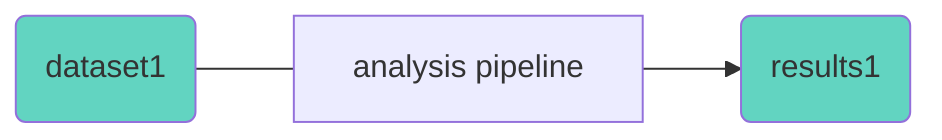
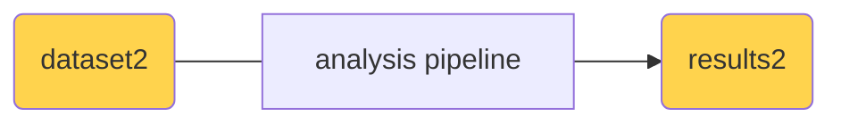

# Materials & Methods ✅

```bash
fastqc assays/rnaseq/dataset/sample1.fastq.gz
fastqc assays/rnaseq/dataset/sample2.fastq.gz
fastqc assays/rnaseq/dataset/ ...
```

"*FastQC v0.12.1 was employed for read quality control using default parameters.*"

---

# Are we **FAIR**, yet?

- where did I click
- reproducibility
- record exactly what I've done
- history
- instruction
- tool version
- ...

<!-- 
- Installation / Environment
- Version
- Input / Output
 -->

<div class="absolute bottom-20 left-20">
*FAIR: Findable, Accessible, Interoperable, Reusable
</div>


---

# Some factors affecting [reproduci|reusa|replica]bility

- Version of tool, software, package, or library
- Version of interpreter (python, R, F#, etc.)
- Operating system (linux, win, mac) and version
- ...

---


# What Are Computational Workflows?

- Define **steps** in data analysis (e.g., preprocessing → alignment → QC)
- Each step specifies:
  - **Inputs**
  - **Outputs**
  - **Tools / Commands**
- Enable:
  - Reproducibility  
  - Portability  
  - Scalability

---
layout: two-columns
---

# Why Workflows?

::left::

- **Reproducibility** of the data
- **Replicability** of the analysis





Re-running the **same** analysis on the **same** dataset

::right::

- **Reusability** of the analysis



Applying the same analysis on **another** dataset
