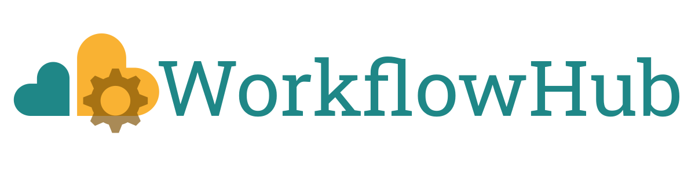

# Workflow Platforms

---

# Galaxy

- Web-based platform for **data-intensive research**
- Visual drag-and-drop workflow builder
- Integrates with CWL, Nextflow, Snakemake

https://galaxyproject.org

---

  
  <a class="text-xs text-gray-400" target="_blank" href="https://workflowhub.eu/">https://workflowhub.eu</a>

# WorkflowHub

- **FAIR registry** for describing, sharing and publishing scientific computational workflows
- Supports multiple workflow languages  
- Provides metadata, versioning, and citation info  
- Facilitates discovery and re-use of workflows in an accessible and interoperable way
- Encourages **reusability** and **collaboration**
- extensive use of **open standards and tools**:
  - [CWL](https://www.commonwl.org/)
  - [RO-Crate](https://www.researchobject.org/ro-crate/)
  - [Bioschemas](https://bioschemas.org/)
