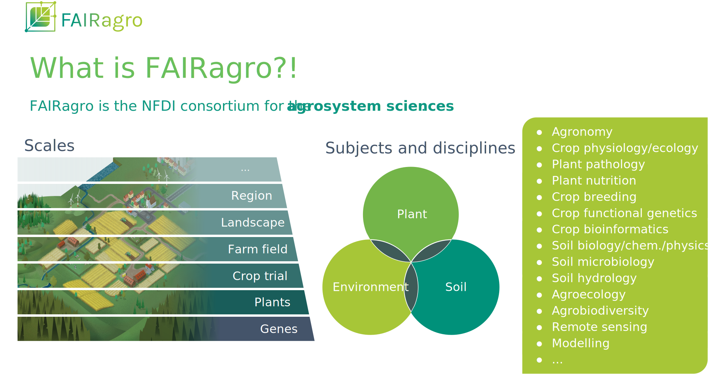

---
src: './custom-bricks/interactive-pad.md'
---

---
src: ./custom-bricks/02-participants.md
---

---
src: '../../public/bricks-dominik/rdm-why.md'
---

---
src: '../../public/bricks-dominik/rdm-data-lifecycle.md'
---

---
src: '../../public/bricks-dominik/rdm-fair.md'
---

---
src: '../../public/bricks-dominik/nfdi.md'
---

---
src: '../../public/bricks-dominik/dataplant.md'
---

---
src: 'custom-bricks/datastewardship-community.md'
---

---
src: '../../public/bricks-dominik/dataplant-resources.md'
---

---
layout: center
---

https://fairagro.net/

---
src: '../../public/bricks-dominik/arc-overview.md'
---

---
src: '../../public/bricks-dominik/arc-standards.md'
---

---
src: '../../public/bricks-dominik/datahub-plantdatahub.md'
---

---
src: '../../public/bricks-dominik/arc-ecosystem.md
---

---
src: './custom-bricks/99-acknowledgements.md'
---

---
src: './custom-bricks/goals-day1.md'
---

---
src: '../../public/bricks-dominik/exercise-starthere-checkpoint-1.md'
---

---
src: '../../public/bricks-dominik/exercise-starthere-checkpoint-2.md'
---

---
layout: cover
coverDate: October 30th, 2025
src: './custom-bricks/00-title.md'
---

---
src: './custom-bricks/goals-day2.md'
---

<!-- This is the break point between 3 vs. 6 hrs workshops -->

---
src: '../../public/bricks-dominik/exercise-starthere-checkpoint-3.md'
---

---
src: '../../public/bricks-dominik/exercise-starthere-checkpoint-4.md'
---

---
src: '../../public/bricks-dominik/dataplant-resources.md'
---

---
src: './custom-bricks/99-acknowledgements.md'
---
